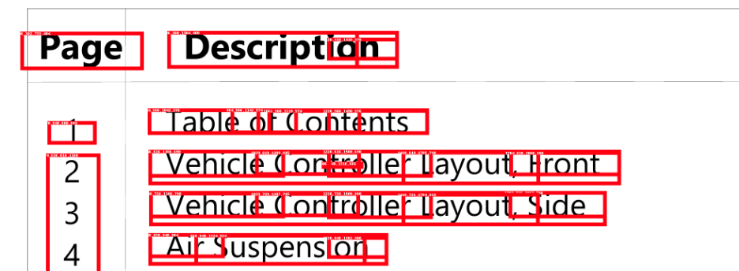
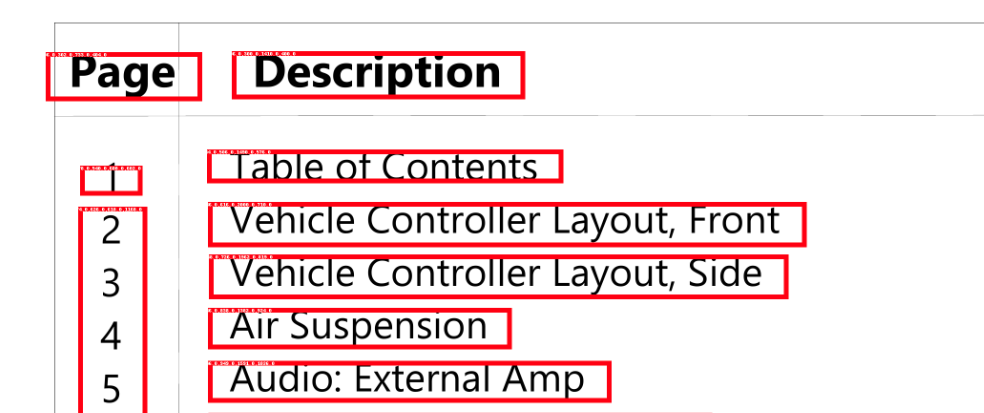

# Bounding Box Merger

This code will help you out in merging your Boundingbox

## Installation

```bash
pip install bbox-merger
```

## Example Usage

### Merge Boxes

```python
from bbox_merger import merge_boxes
boxes = [[0, 0, 2, 2], [1, 1, 3, 3], [4, 4, 6, 6]]
merged_boxes = merge_boxes(boxes)
print(merged_boxes)
```

```
output: [[0.0, 0.0, 3.0, 3.0], [4.0, 4.0, 6.0, 6.0]]
```

### Calculate IOU

```python
from bbox_merger import calculate_iou
box1 = [0, 0, 2, 2]
box2 = [1, 1, 3, 3]
merged_boxes = calculate_iou(box1, box2)
print(merged_boxes)
```

```
output: 0.14285714285714285
```

# Example

1. Before Merging Bounding Boxes
   
2. After Merging Bounding Boxes
   

---

## Thing To cover

- Add support for polygons
